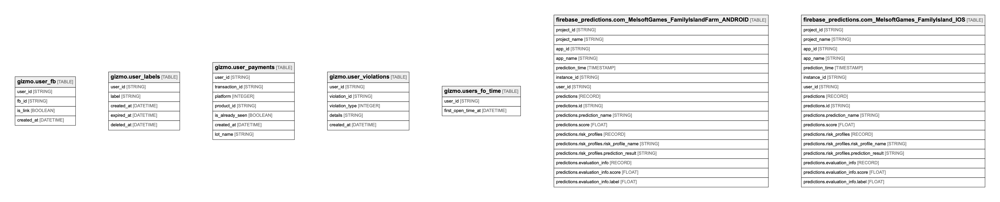

# MySQL schema

## Tables

| Name | Columns | Comment | Type |
| ---- | ------- | ------- | ---- |
| [gizmo.user_fb](gizmo.user_fb.md) | 4 |  | TABLE |
| [gizmo.user_labels](gizmo.user_labels.md) | 5 |  | TABLE |
| [gizmo.user_payments](gizmo.user_payments.md) | 7 |  | TABLE |
| [gizmo.user_violations](gizmo.user_violations.md) | 5 |  | TABLE |
| [gizmo.users_fo_time](gizmo.users_fo_time.md) | 2 |  | TABLE |
| [firebase_predictions.com_MelsoftGames_FamilyIslandFarm_ANDROID](firebase_predictions.com_MelsoftGames_FamilyIslandFarm_ANDROID.md) | 17 | This table contains the Prediction results for each unique instance identifier in this app. Each new set of Prediction results is stored in a new partition. The table also contains holdout samples that were used in assessing the model performance.  | TABLE |
| [firebase_predictions.com_MelsoftGames_FamilyIsland_IOS](firebase_predictions.com_MelsoftGames_FamilyIsland_IOS.md) | 17 | This table contains the Prediction results for each unique instance identifier in this app. Each new set of Prediction results is stored in a new partition. The table also contains holdout samples that were used in assessing the model performance.  | TABLE |

## Relations

---

> Generated by [tbls](https://github.com/Melsoft-Games/tbls)
