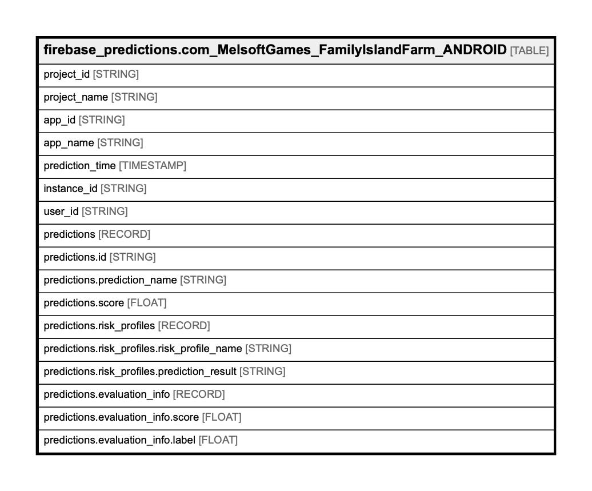

# firebase_predictions.com_MelsoftGames_FamilyIslandFarm_ANDROID

## Description

This table contains the Prediction results for each unique instance identifier in this app. Each new set of Prediction results is stored in a new partition. The table also contains holdout samples that were used in assessing the model performance.  

## Columns

| Name | Type | Default | Nullable | Children | Parents | Comment |
| ---- | ---- | ------- | -------- | -------- | ------- | ------- |
| project_id | STRING |  | true |  |  | The GCP project ID |
| project_name | STRING |  | true |  |  | The GCP project name |
| app_id | STRING |  | true |  |  | The Firebase application ID |
| app_name | STRING |  | true |  |  | The Firebase application name |
| prediction_time | TIMESTAMP |  | true |  |  | Prediction timestamp |
| instance_id | STRING |  | true |  |  | Unique identifier for each instance ID |
| user_id | STRING |  | true |  |  | Developer defined user ID |
| predictions | RECORD |  | true |  |  | List of predictions for this app |
| predictions.id | STRING |  | true |  |  | Unique identifier for each prediction |
| predictions.prediction_name | STRING |  | true |  |  | Name of the prediction as listed in the Firebase console |
| predictions.score | FLOAT |  | true |  |  | User's raw score for this prediction  |
| predictions.risk_profiles | RECORD |  | true |  |  | List of available risk profiles |
| predictions.risk_profiles.risk_profile_name | STRING |  | true |  |  | Name of the risk profile |
| predictions.risk_profiles.prediction_result | STRING |  | true |  |  | Result of the prediction for this instance given this risk profile  |
| predictions.evaluation_info | RECORD |  | true |  |  | If present, this was part of the holdout set used to evaluate the model |
| predictions.evaluation_info.score | FLOAT |  | true |  |  | Evaluation prediction score (between 0.0 or 1.0) |
| predictions.evaluation_info.label | FLOAT |  | true |  |  | Evaluation label (either 0.0 [negative] or 1.0 [positive]) |

## Relations

---

> Generated by [tbls](https://github.com/Melsoft-Games/tbls)
