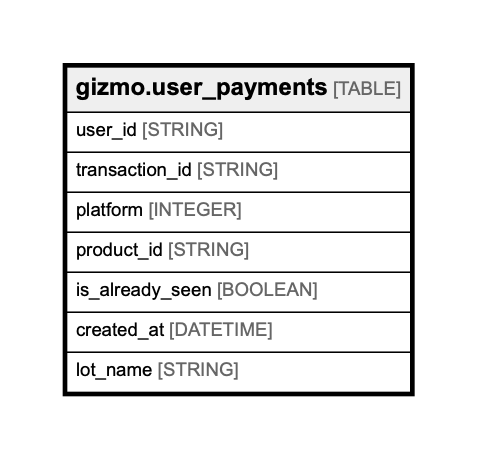

# gizmo.user_payments

## Description

## Columns

| Name | Type | Default | Nullable | Children | Parents | Comment |
| ---- | ---- | ------- | -------- | -------- | ------- | ------- |
| user_id | STRING |  | false |  |  | Unique user id, uuid |
| transaction_id | STRING |  | false |  |  | Unique transaction id, string |
| platform | INTEGER |  | false |  |  | Platform is one of (android-0, ios-1), integer |
| product_id | STRING |  | false |  |  | Store product id, string |
| is_already_seen | BOOLEAN |  | false |  |  | Flag indicates already seen payment, bool |
| created_at | DATETIME |  | false |  |  | Payment time, datetime |
| lot_name | STRING |  | true |  |  |  |

## Relations

---

> Generated by [tbls](https://github.com/Melsoft-Games/tbls)
