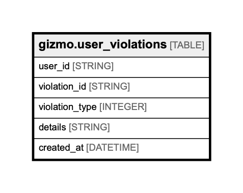

# gizmo.user_violations

## Description

## Columns

| Name | Type | Default | Nullable | Children | Parents | Comment |
| ---- | ---- | ------- | -------- | -------- | ------- | ------- |
| user_id | STRING |  | false |  |  | Unique user id, uuid |
| violation_id | STRING |  | false |  |  | Unique violation id, uuid |
| violation_type | INTEGER |  | false |  |  | Violation type, one of (spam = 1; swearing = 2; cheater = 3; etc), integer |
| details | STRING |  | true |  |  | Free-format string with details, string |
| created_at | DATETIME |  | false |  |  | Creation time of violation, datetime |

## Relations

---

> Generated by [tbls](https://github.com/Melsoft-Games/tbls)
