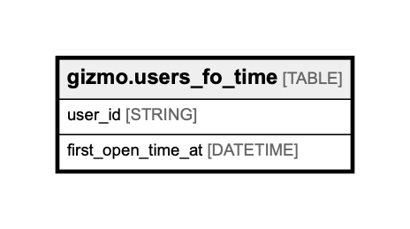

# gizmo.users_fo_time

## Description

## Columns

| Name | Type | Default | Nullable | Children | Parents | Comment |
| ---- | ---- | ------- | -------- | -------- | ------- | ------- |
| user_id | STRING |  | false |  |  | Unique user id, uuid |
| first_open_time_at | DATETIME |  | false |  |  | Creation time of violation, datetime |

## Relations

---

> Generated by [tbls](https://github.com/Melsoft-Games/tbls)
